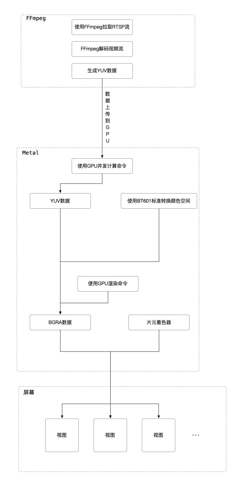
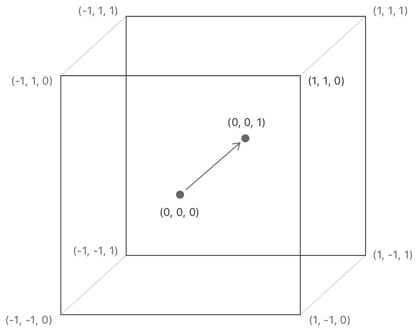

# RTST视频播放
- 视频拉流解码库为`ffmpeg 4.2`
- 图形渲染使用的是`MetalKit`
- 主要代码路径: 
    - `WGDispatch/Video`主要用来拉流和解码
    - `WGDispatch/Metal`主要用来视频和图片的渲染

### 流程图


# 逻辑
### ffmpeg
代码路径: `WGDispatch/Video/VideoPlayer.swift`

#### 拉流
```swift
// 拉流的参数
// [ffmpeg文档参考](https://ffmpeg.org/ffmpeg-protocols.html#rtsp)
var opts: OpaquePointer?
av_dict_set(&opts, "rtsp_transport", "udp", 0)
av_dict_set(&opts, "allowed_media_types", "video", 0)

// 打开RTSP
var path = "rtsp://"
var mpFormatCtx: UnsafeMutablePointer<AVFormatContext>!
var state = avformat_open_input(&mpFormatCtx, path, nil, &opts)
// 异常处理
// ...

// 用来检测连接状态和读取帧操作的心跳处理
// 读取帧3次失败则认为连接异常
var heartbeat = Heartbeat()

// 解码时的(I/O层)回调
// 返回0为继续, 1为中断
// 这里写的是如果操作时间大于1秒定义为操作超时, 中断操作
mpFormatCtx.pointee.interrupt_callback.opaque = Unmanaged.passUnretained(self).toOpaque()
mpFormatCtx.pointee.interrupt_callback.callback = { sender in
    let `self` = Unmanaged<VideoManager.Player>.fromOpaque(sender!).takeUnretainedValue()
    return `self`.heartbeat.isPing ? 0 : 1
}

// RTSP里有视频流、音频流、字幕流等
// 业务只需要处理视频流
// 查找视频流的索引
let streamIndex = (0..<mpFormatCtx.pointee.nb_streams).first {
    mpFormatCtx.pointee.streams[Int($0)]!.pointee.codecpar.pointee.codec_type == AVMEDIA_TYPE_VIDEO
}

// 创建AVCodecContext
var mpCodecCtx = avcodec_alloc_context3(nil)
state = avcodec_parameters_to_context(mpCodecCtx, mpFormatCtx.pointee.streams[streamIndex]!.pointee.codecpar)
// 异常处理
// ...

// 查找解码器
let mpCodec = avcodec_find_decoder(mpCodecCtx.pointee.codec_id)
// 打开解码器
state = avcodec_open2(mpCodecCtx, mpCodec, nil)
// 异常处理
// ...

// 用来储存解码后的数据
var mpFrame = av_frame_alloc()
// 用来储存前后的帧数据
var mpPacket = av_packet_alloc()
// 异常处理
// ...

// ...

// 使用完成后需要释放
avformat_close_input(&mpFormatCtx)
avcodec_free_context(&mpCodecCtx)
av_frame_free(&mpFrame)
av_packet_free(&mpPacket)
```
#### 解码
以一秒25次的频率调用解码方法
```swift
// 清理AVPacket
av_packet_unref(mpPacket)

// 重制ping时间
heartbeat.ping()

// 从流中读取未解码的数据
var state = av_read_frame(mpFormatCtx, mpPacket)
if state < 0 {
    // 记录异常
    heartbeat.throwError()

    // 3次抛出异常则认为连接异常
    if !heartbeat.isConnect {
        // 关闭流
        // 重新拉流
        // ...
    }

    return
}

// 忽略视频流以外的流
if mpPacket.pointee.stream_index != streamIndex { return }

// 将未解码的数据作为解码器的输入
state = avcodec_send_packet(mpCodecCtx, mpPacket)
// 异常处理
// ...

// 支持视频的格式
guard mpCodecCtx.pointee.pix_fmt == AV_PIX_FMT_YUVJ420P
    || mpCodecCtx.pointee.pix_fmt == AV_PIX_FMT_YUV420P else {
    return
}

// 清理AVFrame
av_frame_unref(mpFrame)

// 从解码器返回输出解码的YUV420P数据
state = avcodec_receive_frame(mpCodecCtx, mpFrame)
// 异常处理
// ...

// 调用渲染方法
// ...
```

### Metal
#### 初始化
代码路径`WGDispatch/Metal/MetalManager.swift`

[GPU坐标参考文档](https://developer.apple.com/documentation/metal/using_a_render_pipeline_to_render_primitives)


[纹理坐标参考文档](https://developer.apple.com/documentation/metal/creating_and_sampling_textures)


```c
// 顶点结构体
typedef struct Vertex {
    
    // GPU坐标
    vector_float4 position;
    // 纹理坐标
    vector_float2 textureCoordinate;
    
} Vertex;
```
```swift
// 获取GPU
let device = MTLCreateSystemDefaultDevice()
// 异常处理
// ...

/* 矩形由2个三角形6个顶点组成
  index: 1    index: 0, 3
       *-------------*
       |             |
       |             |
       |             |
       *-------------*
  index: 2, 4   index: 5
*/

var vertexs = [
    Vertex(position: .init(x:  1.0, y:  1.0, z: 0.0, w: 1.0), textureCoordinate: .init(x: 1.0, y: 0.0)),
    Vertex(position: .init(x: -1.0, y:  1.0, z: 0.0, w: 1.0), textureCoordinate: .init(x: 0.0, y: 0.0)),
    Vertex(position: .init(x: -1.0, y: -1.0, z: 0.0, w: 1.0), textureCoordinate: .init(x: 0.0, y: 1.0)),
            
    Vertex(position: .init(x:  1.0, y:  1.0, z: 0.0, w: 1.0), textureCoordinate: .init(x: 1.0, y: 0.0)),
    Vertex(position: .init(x: -1.0, y: -1.0, z: 0.0, w: 1.0), textureCoordinate: .init(x: 0.0, y: 1.0)),
    Vertex(position: .init(x:  1.0, y: -1.0, z: 0.0, w: 1.0), textureCoordinate: .init(x: 1.0, y: 1.0))
]

// 创建顶点缓冲区
let buffer = device.makeBuffer(bytes: &vertexs, length: MemoryLayout<Vertex>.stride * vertexs.count, options: .storageModeShared)
// 异常处理
// ...
```

#### 渲染
代码路径`WGDispatch/Metal/VideoMetal.swift`
MTKView不支持YUV格式需要转换为BGRA格式

[提交队列和提交缓冲区参考文档](https://developer.apple.com/documentation/metal/setting_up_a_command_structure)
[线程网格组大小和网格大小参考文档](https://developer.apple.com/documentation/metal/calculating_threadgroup_and_grid_sizes)

##### YUV转码为BGRA
使用GPU计算命令转码
```swift

// 创建提交队列
// 可保存对象引用重复使用
let commandQueue = device.makeCommandQueue()
// 异常处理
// ...

// 创建计算命令
let convertCommand = commandQueue.makeCommandBuffer()
// 异常处理
// ...

// 创建编码器
let convertEncoder = convertCommand.makeComputeCommandEncoder()
// 异常处理
// ...

// 创建生成计算管道
// 耗性能操作, 可保存对象引用重复使用
// [方法实现可参考](#着色器)
let library = device.makeDefaultLibrary()
let yuvConvert = library?.makeFunction(name: "yuvConvert")
let convertPipeline = try device.makeComputePipelineState(function: yuvConvert)
// 异常处理
// ...

// 设置计算管道
convertEncoder.setComputePipelineState(convertPipeline)

// 创建纹理, 纹理用来储存图像数据
// YUV纹理用来存放解码的YUV数据
// BGRA纹理用来存放转码的BGRA数据
// 可保存对象引用重复使用
let regionY = MTLRegion(origin: .init(x: 0, y: 0, z: 0), size: .init(width: Int(mpFrame.pointee.width), height: Int(mpFrame.pointee.height), depth: 1))
let regionUV = MTLRegion(origin: .init(x: 0, y: 0, z: 0), size: .init(width: Int(mpFrame.pointee.width / 2), height: Int(mpFrame.pointee.height / 2), depth: 1))
        
let descriptor = MTLTextureDescriptor()
descriptor.pixelFormat = .r8Unorm
descriptor.cpuCacheMode = .writeCombined
descriptor.storageMode = .shared
descriptor.usage = .shaderRead
descriptor.width = regionY.size.width
descriptor.height = regionY.size.height
let textureY = device.makeTexture(descriptor: descriptor)
// 异常处理
// ...

descriptor.width = regionUV.size.width
descriptor.height = regionUV.size.height
let textureU = device.makeTexture(descriptor: descriptor)
let textureV = device.makeTexture(descriptor: descriptor)
// 异常处理
// ...
        
descriptor.pixelFormat = .bgra8Unorm
descriptor.cpuCacheMode = .defaultCache
descriptor.storageMode = .private
descriptor.usage = [.shaderRead, .shaderWrite]
descriptor.width = regionY.size.width
descriptor.height = regionY.size.height
let textureBGRA = device.makeTexture(descriptor: descriptor)
// 异常处理
// ...

// 在解码完成后设置YUV纹理
textureY.replace(region: regionY, mipmapLevel: 0, withBytes: mpFrame.pointee.data.0!, bytesPerRow: Int(mpFrame.pointee.linesize.0))
textureU.replace(region: regionUV, mipmapLevel: 0, withBytes: mpFrame.pointee.data.1!, bytesPerRow: Int(mpFrame.pointee.linesize.1))
textureV.replace(region: regionUV, mipmapLevel: 0, withBytes: mpFrame.pointee.data.2!, bytesPerRow: Int(mpFrame.pointee.linesize.2))

// 为计算方法设置纹理数组
convertEncoder.setTextures([textureY, textureU, textureV, textureBGRA], range: 0..<4)

// 线程网格大小
let threads = MTLSize(width: convertPipeline.threadExecutionWidth, height: convertPipeline.maxTotalThreadsPerThreadgroup / convertPipeline.threadExecutionWidth, depth: 1)

// 线程网格组大小
MTLSize(width: (textureY.width + Metal!.video!.threads.width - 1) / Metal!.video!.threads.width,
        height: (textureY.height + Metal!.video!.threads.height - 1) / Metal!.video!.threads.height,
        depth: 1)


// 设置网格组大小和网格大小
convertEncoder.dispatchThreadgroups(player.threadGrid, threadsPerThreadgroup: threads)

// 结束编码器
convertEncoder.endEncoding()

// 提交计算命令
convertCommand.commit()
```

##### 绘制
```swift
let view = MTKView()

// 创建渲染命令
let renderCommand = commandQueue.makeCommandBuffer()
// 异常处理
// ...

// 创建编码器
let encoder = renderCommand.makeRenderCommandEncoder(descriptor: view.currentRenderPassDescriptor)
// 异常处理
// ...

// 创建生成渲染管道
// 耗性能操作, 可保存对象引用重复使用
// [方法实现可参考](#着色器)
let descriptor = MTLRenderPipelineDescriptor()
descriptor.vertexFunction = library?.makeFunction(name: "vertexShader")
descriptor.fragmentFunction = library?.makeFunction(name: "fragmentShader")
descriptor.colorAttachments[0].pixelFormat = .bgra8Unorm
let pipeline = try device.makeRenderPipelineState(descriptor: descriptor)
// 异常处理
// ...

// 设置渲染管道
encoder.setRenderPipelineState(pipeline)

// 设置顶点缓冲区
encoder.setVertexBuffer(buffer, offset: 0, index: 0)

// 设置片段纹理
encoder.setFragmentTexture(textureBGRA, index: 0)

// 绘制基元
encoder.drawPrimitives(type: .triangle, vertexStart: 0, vertexCount: vertexs.count)

// 结束编码器
encoder.endEncoding()

// 绘制
renderCommand.present(drawable)
view.draw()

// 提交绘制命令
renderCommand.commit()
```

##### 图片生成BGRA纹理
```swift
// 创建纹理加载器
// 可保存对象引用重复使用
let loader = MTKTextureLoader(device: device)

// 使用加载器创建纹理
let texture = try loader.newTexture(URL: url, options: [.SRGB: false])
let texture = try loader.newTexture(cgImage: cg, options: [.SRGB: false])
// 使用Data加载时, 如果为空会崩溃
let texture = try loader.newTexture(data: data, options: [.SRGB: false])
// 异常处理
// ...

```

##### 着色器
[参考文档](https://developer.apple.com/metal/Metal-Shading-Language-Specification.pdf)
[BT.601参考文档](http://www.color.org/chardata/rgb/BT601.xalter)
GPU上运行的代码

```c++
typedef struct RasterizerData {
    
    /// position的修饰符表示这个是顶点
    float4 clipSpacePosition [[position]];
    /// 纹理坐标，会做插值处理
    float2 textureCoordinate;
    
} RasterizerData;

typedef struct ConvertMatrix {
    
    matrix_half3x3 matrix;
    vector_half3 offset;
    
} ConvertMatrix;

/// BT.601 full range
/// YUV转换为RGB矩阵
constant ConvertMatrix fullRangeBT601 = {
    {
        {1.0, 1.0, 1.0},
        {0.0, -0.343, 1.765},
        {1.4, -0.711, 0.0}
    },
    { -(16.0 / 255.0), -0.5, -0.5 }
};

/// 采样器
constexpr sampler textureSampler;

/// 顶点着色器
/// - Parameters:
///   - vertex_id: 是顶点shader每次处理的index，用于定位当前的顶点
///   - buffer: 表明是缓存数据，0是索引
/// - Returns: 返回给片元着色器的结构体
vertex RasterizerData vertexShader(uint vertexID [[ vertex_id ]], constant Vertex *vertexArray [[ buffer(0) ]]) {
    RasterizerData out;
    out.clipSpacePosition = vertexArray[vertexID].position;
    out.textureCoordinate = vertexArray[vertexID].textureCoordinate;
    
    return out;
}

/// 片段着色器
/// - Parameters:
///   - input: stage_in表示这个数据来自光栅化。（光栅化是顶点处理之后的步骤，业务层无法修改）
///   - bgra: texture表明是纹理数据，0是索引
/// - Returns: BGRA数据
fragment half4 fragmentShader(RasterizerData input [[stage_in]], texture2d<half> bgra [[ texture(0) ]]) {
    // 得到纹理对应位置的颜色
    return bgra.sample(textureSampler, input.textureCoordinate);
}

/// YUV转码BGRA
kernel void yuvConvert(uint2 grid [[ thread_position_in_grid ]],
                       texture2d<half, access::read> y [[ texture(0) ]],
                       texture2d<half, access::read> u [[ texture(1) ]],
                       texture2d<half, access::read> v [[ texture(2) ]],
                       texture2d<half, access::write> bgra [[ texture(3) ]]) {    
    uint2 uvGrid = grid / 2;
    half3 yuv = half3(y.read(grid).r, u.read(uvGrid).r, v.read(uvGrid).r);
    
    half3 bgrData = fullRangeBT601.matrix * (yuv + fullRangeBT601.offset);
    bgra.write(half4(bgrData, 1.0), grid);
}
```
